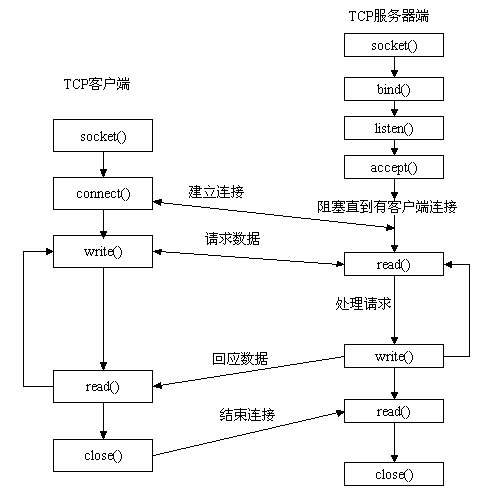
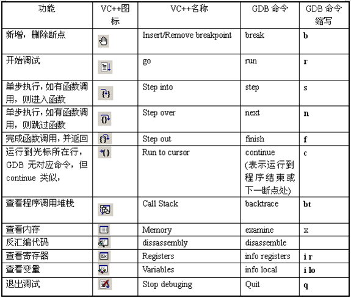

# socket之TCP初等函数概述
1. 通过网络初等函数, 建立客户端服务端模型
2. 使用TCP协议, AF_INET协议族(ipv4)

# TCP的socket通信原理图
1. TCP客户端服务端通信过程


2. GDB使用技巧


# 使用的初等函数和创建过程
```c
//服务端:
//创建socket,传入协议族AF_INET,socket类型,协议0,返回sockfd
int socket(int domain, int type, int protocol);
type:
	SOCK_STREAM流式套接字
    SOCK_DGRAM数据报套接字
    原始套接字
//创建struct sockaddr_in地址,并填充信息
//字符串地址转换网络字节序地址
inet_pton(AF_INET,addr,&g_pSvr->svrAddr.sin_addr);
//inet_ntop()//网络转字符串
g_pSvr->svrAddr.sin_port = htons(PORT);
//将sockfd和地址信息绑定
int bind(int sockfd, const struct sockaddr *addr,socklen_t addrlen);
//监听客户端的connect请求,将请求加入队列,队长度backlog
int listen(int sockfd, int backlog);
//循环accept接收,使用返回的链接句柄发送和接受
int accept(int sockfd, struct sockaddr *addr, socklen_t *addrlen);
//成功则返回发送字符数, 失败-1
ssize_t send(int sockfd, const void *buf, size_t len, int flags);

//客户端:
//socket()-> connect() -> recv()
//addr为服务器信息
int connect(int sockfd, const struct sockaddr *addr,socklen_t addrlen);
```

